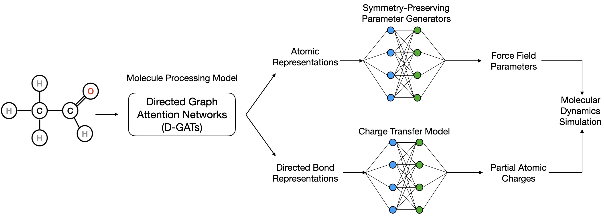
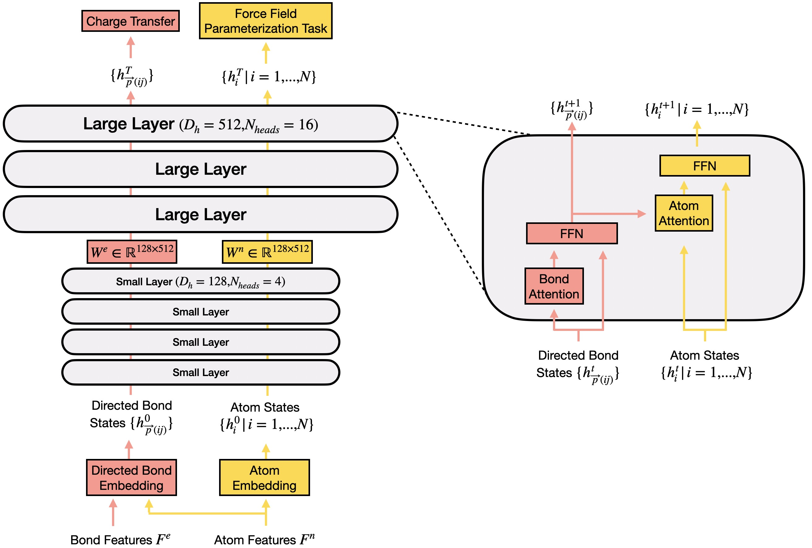
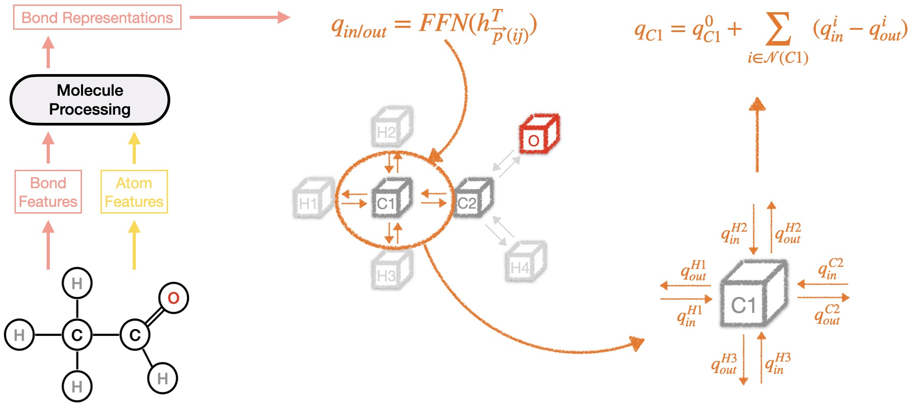
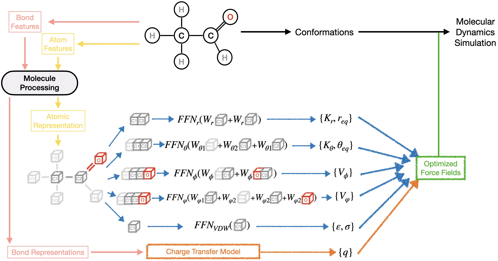
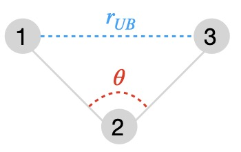
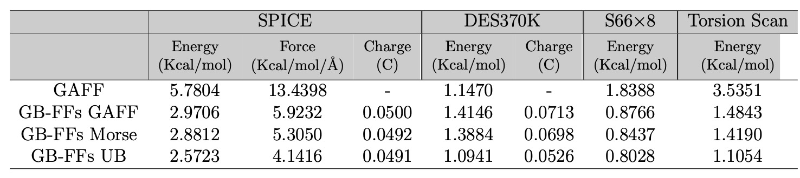
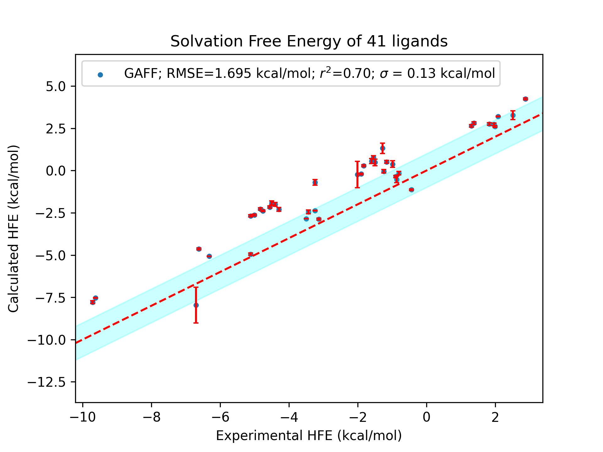
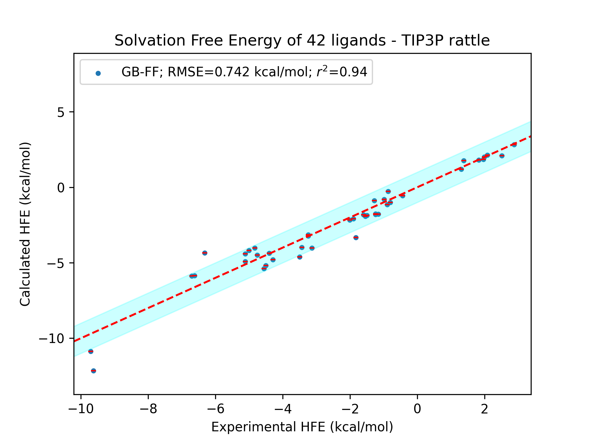

Advancing Force Fields Parameterization: A Directed Graph Attention Networks Approach

==================================================================================

Authors: Gong Chen, Théo Jaffrelot Inizan, Thomas Plé, Louis Lagardère, Jean-Philip Piquemal, Yvon Maday

In this tutorial, we will present how to use the Graph-Based Force Fields (GB-FFs) model. GB-FF predicts force field (FF) parameters from chemical environments (SMILES, SDF, PDB). By adopting an end-to-end parameterization methodology, the GB-FFs model eliminates the requirement for expert-defined procedures, leading to improved accuracy and transferability of classical FFs across a wider range of molecular complexes.

<p align="center"></p>

Dependencies
-------------

The code requires jupyter, rdkit, openbabel and pytorch.

We advice the following environment:
```
conda create -n GB_FFs python=3.8
conda activate GB_FFs
conda install -c anaconda jupyter
conda install -c conda-forge openbabel
conda install -c rdkit rdkit
conda install -c conda-forge pytorch-gpu 
(or) conda install -c conda-forge pytorch
```

Model Architecture
-------------------

GB-FFs Model is composed of three inter-connected parts. 

The first is Molecule Processing Model which is used to aggregate information and extract atom/bond representations.

<p align="center"></p>

The second part is the Charge Transfer Model. Building on the bond representations from the Molecule Processing Model, this part predicts the transfer of charges in and out for each atom.

<p align="center"></p>

The Symmetry-Preserving Parameter Generator constitutes the last part and is responsible for predicting all the remaining force field parameters.

<p align="center"></p>


Functional Forms
-----------------

In the original article we conducted a preliminary investigation into the functional forms of GAFF.

The model 'GB-FFs GAFF' preserves the original GAFF functional forms, with all force field parameters generated by our model.

The model 'GB-FFs Morse' replaces the harmonic function for bond stretching energy with the Morse function. To maintain the same number of parameters, we set the Morse function's $\alpha$ as a constant value of 2.

The model 'GB-FFs UB' incorporates the complete Morse function for bond stretching energy and includes the Urey-Bradley (UB) terms.

To use the models with different functional forms, you need set "bond_morse" and "bool_ub" in Jupyter Notebook and choose the correct model to load.

<p align="center"></p>


Utilization
-----------

While our work is primarily trained to optimize the General Amber Force Field (GAFF), it can be extended to other non-polarizable force fields with minimal modifications.

To pre-train the GB-FFs models on a database, such as ANI-1 database. You would need first to download the ANI-1 database and preprocess the molecules using the jupyter notebook(data/ANI-1/ANI-1.ipynb). You should then open 'PreTraining.ipynb' in Jupyter Notebook and execute the provided code.

To fine-tuned your model, such as on the SPICE and DES370K databases, pre-process the molecules using (data/DES370K/DES370K.ipynb) and (data/SPICE/SPICE.ipynb).  You should then open 'FineTuning.ipynb' in Jupyter Notebook and execute the provided code. 

To test the code, there are already 100 pre-processed molecules in data/ANI-1, data/DES370K and data/SPICE. You will only need to download the original databases (the command "os.system('wget ...')") and run 'PreTraining.ipynb' and 'FineTuning.ipynb'.

To generate the force filed parameter file, users need to provide PDB files (in GeneratingPara/pdb/) or SDF files (in GeneratingPara/sdf/) and SMILES (in GeneratingPara/smiles/), the latter being optional but recommended. After providing the necessary inputs, users can run 'ParaFileGenerator.ipynb' to generate parameter files.

To test the code, there are already 3 sdf files in GeneratingPara/sdf. You can run 'ParaFileGenerator.ipynb' directly.


GB-FFs Models' performance
--------------------------

Capability to predict the atom types in GAFF:

<p align="center"></p>

Performance of all models on various databases:

<p align="center"></p>

Comparison of the performance in hydration free energy calculations:

<p align="center"></p>

Citation
--------

Please kindly cite this paper if you use the code.
```
Gong Chen, Théo Jaffrelot Inizan, Thomas Plé, Louis Lagardère, Jean-Philip Piquemal, and Yvon Maday. Advancing force fields parameterization: A directed graph attention networks approach. 2023.

```
```
@article{chen2023advancing,
  title={Advancing force fields parameterization: A directed graph attention networks approach},
  author={Chen, Gong and Inizan, Théo Jaffrelot and Plé, Thomas and Lagardère, Louis and Piquemal, Jean-Philip and Maday, Yvon},
  journal={ChemRxiv},
  year={2023},
  doi={10.26434/chemrxiv-2023-nz8hc}
}
```

License
-------

This project is licensed under the terms of the MIT license. See [LICENSE](https://github.com/GongCHEN-1995/D-GATs/blob/main/LICENSE) for additional details.

