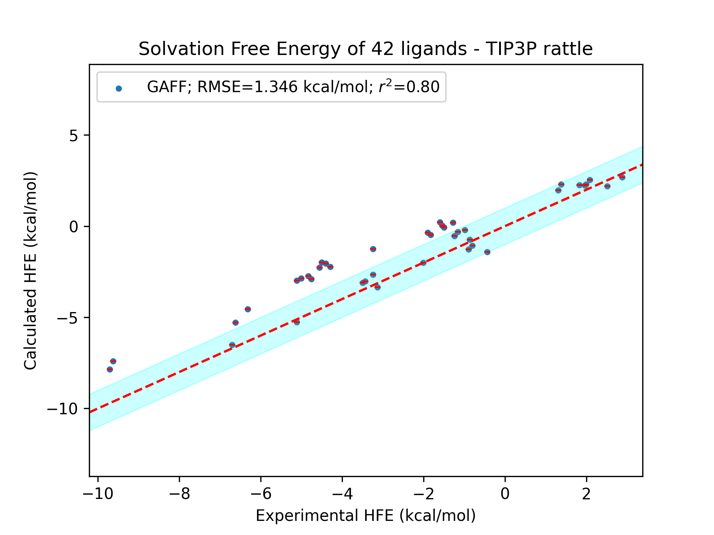

Advancing Force Fields Parameterization: A Directed Graph Attention Networks Approach

==================================================================================

Authors: Gong Chen, Théo Jaffrelot Inizan, Thomas Plé, Louis Lagardère, Jean-Philip Piquemal, Yvon Maday

The Graph-Based Force Fields (GB-FFs) model is designed to directly derive parameters for non-polarizable (currently) force fields based on chemical environments and research into investigate the influence of functional forms. By adopting an end-to-end parameterization methodology, the GB-FFs model eliminates the requirement for expert-defined procedures, leading to improved accuracy and transferability of classical force fields across a wider range of molecular complexes.

<p align="center"></p>

Dependencies
-------------

To run the code, it requires jupyter, rdkit and pytorch.

We advice the following environment:
```
conda create -n GB_FFs python=3.8
conda activate GB_FFs
conda install -c anaconda jupyter
conda install -c conda-forge openbabel
conda install -c rdkit rdkit
conda install -c conda-forge pytorch-gpu 
(or) conda install -c conda-forge pytorch
```

Model Architecture
-------------------

GB-FFs Model is composed of three inter-connected parts. 

The first is Molecule Processing Model which is used to aggregate information and extract atom/bond representations.

<p align="center"></p>

The second part is the Charge Transfer Model which assumes that charge can move between connected atoms. Based on the bond representations from Molecule Processing Model, this part predicts the charge moves in/out for each atoms.

<p align="center"></p>

Symmetry-Preserving Parameter Generator is the last part that predicts all rest force field parameters.

<p align="center"></p>


Functional Forms
-----------------

We conducted a preliminary investigation into the performance of different functional forms in GAFF.

The model 'GB-FFs GAFF' preserves the original GAFF functional forms, with all force field parameters generated by our model.

The model 'GB-FFs Morse' replaces the harmonic function for bond stretching energy with the Morse function. To maintain the same number of parameters, we set the Morse function's $\alpha$ as a constant value of 2.

The model 'GB-FFs UB' incorporates the complete Morse function for bond stretching energy and includes the Urey-Bradley term.

<p align="center"></p>


Utilization
-----------

While our work is primarily trained to optimize the General Amber Force Field (GAFF), it can be extended to other non-polarizable force fields with minimal modifications.

To leverage existing databases, we initially pre-train GB-FFs models on ANI-1 database. To reproduce this step, you need download the ANI-1 databse and pre-process the molecules (data/ANI-1/ANI-1.ipynb). Then you can open 'PreTraining.ipynb' in Jupyter Notebook and execute the provided code. Then you can open 'PreTraining.ipynb' in Jupyter Notebook and execute the provided code. 

Subsequently, the GB-FFs models undergo fine-tuning on the SPICE and DES370K databases. For reproduction, you need download the databses and pre-process the molecules (data/DES370K/DES370K.ipynb and data/SPICE/SPICE.ipynb). Then please use Jupyter Notebook to open 'FineTuning.ipynb' and run the code.

To test the code, there are already 100 pre-processed molecules in data/ANI-1, data/DES370K and data/SPICE. You only need download the original databases (the command "os.system('wget ...')") and then you can run 'PreTraining.ipynb' and 'FineTuning.ipynb'.

To generate the ParaFileGenerator.ipynb, users need provide the PDB files (in GeneratingPara/pdb/) or SDF files (in GeneratingPara/sdf/) and SMILES (in GeneratingPara/smiles/) is optional. We recommend users to provide SMILES and SDF files as inputs. Then you can run 'ParaFileGenerator.ipynb' to generate parameter files.

To test the code, there are already 3 sdf files in GeneratingPara/sdf. You can run 'ParaFileGenerator.ipynb' directly.


GB-FFs Models' performance
--------------------------

Capability to predict the atom types in GAFF:

<p align="center"></p>

Performance of all models on various databases:

<p align="center"></p>

Comparison of the performance in hydration free energy calculations:

<p align="center"></p>

Citation
--------

Please kindly cite this paper if you use the code.
```
Gong Chen, Théo Jaffrelot Inizan, Thomas Plé, Louis Lagardère, Jean-Philip Piquemal, and Yvon Maday. Advancing force fields parameterization: A directed graph attention networks approach. 2023.

```

License
-------

This project is licensed under the terms of the MIT license. See [LICENSE](https://github.com/GongCHEN-1995/D-GATs/blob/main/LICENSE) for additional details.

